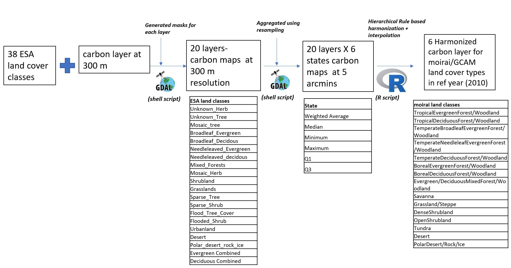
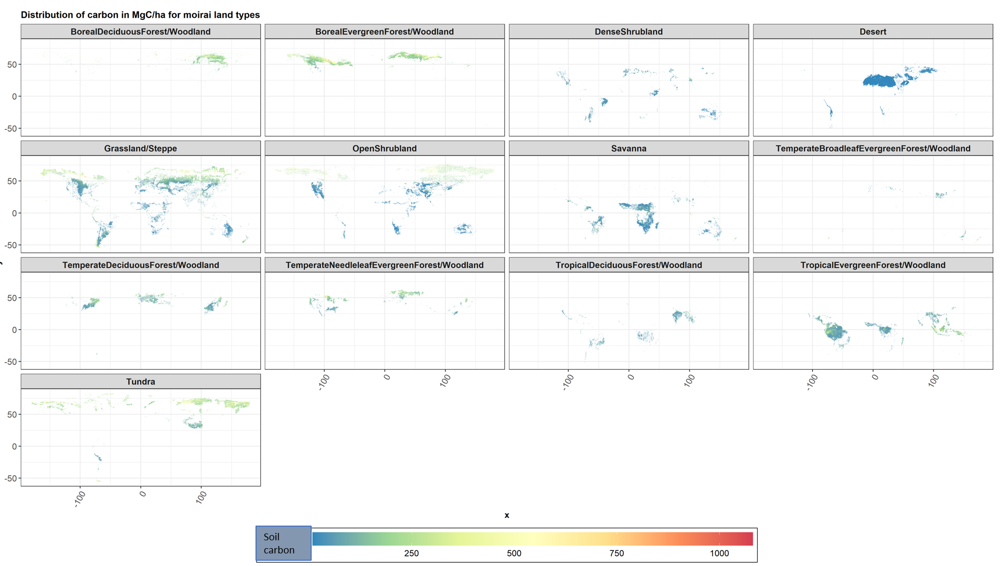

# Carbon data implementation and harmonization for  `moirai`  

## Description:
This folder contains a number of scripts which are used to generate 36 raster files (12 for soil carbon, 12 for above ground carbon, 12 for below ground carbon) that are used by `moirai`. The outputs are rasters where the carbon corresponding to individual land classes are harmonized to moirai's land cover classes from the ESA/IGBP land classes.    

## Input  and intermediate carbon rasters (and the shell scripts used to generate them)

### Raw land cover rasters
* The ESA land cover data (300 m resolution) that is available at https://www.esa-landcover-cci.org/?q=node/164
* The IGBP land cover data (1 km resolution) that is available at https://daac.ornl.gov/cgi-bin/dsviewer.pl?ds_id=968

### Raw carbon data
* Soil carbon density data (250 m resolution) that is available at https://data.isric.org/geonetwork/srv/eng/catalog.search#/metadata/ea80098c-bb18-44d8-84dc-a8a1fbadc061

* FAO Soil carbon density data (1km resolution) that is available at https://daac.ornl.gov/SOILS/guides/HWSD.html

* Above and below ground vegetation carbon data from Spawn et al. that is available at https://www.nature.com/articles/s41597-020-0444-4

### Intermediate rasters (Generated by shell scripts)
1230 raster (.bil) files containing carbon by state and ESA/IGBP land class at a 5 arcmin resolution. These are generated using the bash scripts in the folder `bash_scripts` and raw data described above.Note that the user should run the above ground script (`Generate_ESA_LC_rasters.sh`) first since this script will generate land cover files that are used by the other four scripts.The total run time of the four scripts is 10 hours (2.5 hours per script). 

For the sake of convenience the final 1230 outputfiles from the above are made available as zip files (`Carbon_rasters.zip` for the moirai default and `FAO_carbon_rasters.zip` for the HWSD inputs. These are described in detail below in Figure 1.)

## Other inputs
These are the files in the folder `input_files`

* (1) `basin_to_country_mapping.csv`: Mapping file used to map GLU IDs to basin names.
* (2) `ESA_classes.csv`: 19 ESA land cover classes for the carbon accounting
* (3) `ESA_moirai_classes.csv`: Rules for the harmonization i.e. which land classes to map to the moirai cover with a prioritization scheme. 
* (4) `IGBP_classes.csv`: 14 IGBP land cover classes for carbon accounting (Only used when using FAO HWSD data )
* (5) `IGBP_moirai_classes.csv`:  Rules for the harmonization i.e. which land classes to map to the moirai cover with a prioritization scheme.(Only used when using FAO HWSD data )
* (6) `gcam_glu_boundaries_moirai_land_cells_3p1_0p5arcmin.tif`: This is the GLU mapping raster that is generated by `diagnostics/generate_moirai_spatial.R` 
* (7) `refveg_area_carbon.bil`: Carbon area for the reference carbon year set in `moirai.h`. Currently set to 2010. This file is copied from the base outputs of moirai
* (8) `refveg_carbon_thematic.bil`: Land cover classes from moirai in the reference carbon year (currently set to 2010). This file is also copied from the base outputs of moirai.
* (9)  `refveg_area_carbon_2000.bil`: Carbon area for the reference year (2000) set in `moirai.h`. Currently set to 2010. This file is copied from the base outputs of moirai. (Only used when using FAO HWSD data )
* (10) `refveg_carbon_thematic_2000.bil`: Land cover classes from moirai in the reference year  (2000). This file is also copied from the base outputs of moirai.(Only used when using FAO HWSD data )

## Main harmonization script
`moirai_carbon_harmonization.R` which performs the harmonization for three  types of carbon (soil, above ground biomass, below ground biomass) for 6 states (weighted_average, min, max, q1, q3, median). Each type of carbon requires around 20 mins to run through (bringing the total runtime of the script to 1 hour). 

`moirai_carbon_harmonization_FAO.R` which performs the harmonization for soil carbon  for 6 states (weighted_average, min, max, q1, q3, median). Each type of carbon requires around 20 mins to run through (bringing the total runtime of the script to 1 hour). This script is specifically used only when using the FAO HWSD soil carbon data.

## Data availability by source and moirai defaults

The table below explains the availability of data from different sources and the defaults used in `moirai`

## Outputs
18 raster files (.envi) are saved to the outputs folder. These are directly accessed by the LDS. The naming convention of the files is as follows,

`<carbon_type>`_carbon_`<state>`.envi

## Common questions related to inputs and outputs

### How to use the FAO HWSD soil carbon for initialization?

The FAO HWSD has only data for soil carbon (These outputs are generated using `moirai_carbon_harmonization.R` ), but no data for vegetation carbon. Hence to use these outputs, the user will have to create vegetation layers corresponding to the FAO reference year (2000) from Spawn et al. for above and below ground biomass using the script - `moirai_carbon_harmonization.R`.Note that the user will also have to set the reference carbon year to `2000` in `moirai.h`. This is necessary since both soil and vegetation carbon numbers need to use the same reference year. For the convenience of the user, we have pre-generated the outputs (in the `carbon_harmonization/outputs/` folder) for the FAO data.These are the files with the following naming convention-

`<carbon_type>`_carbon_`<state>_FAO`.envi

There are 18 separate files generated for the FAO dataset.

### Do the carbon outputs represent managed land or unmanaged land or both ?

Currently the carbon outputs only represent carbon densities for unmanaged/undisturbed land. We are working on extending our approach to managed land types (Cropland, Pastures, Urbanland). Eventually, our outputs will include both carbon densities for managed and unmanaged land. 

## Description of harmonization process

(NOTE THAT ALL STATISTICS AND PROCESSES DESCRIBED HERE FORWARD ONLY REFERENCE THE `moirai` DEFAULTS. BUT THE SAME PROCESS IS ALSO APPLICABLE TO THE FAO HWSD DATA)

The figure below describes the harmonization process from start to finish.We begin with the raw carbon data and the ESA land classes. Carbon is calculated for each ESA class. This carbon is then resampled to get the 5arcmin map for the same class for each of the 6 states. Finally the R script is used to harmonize the data to the `moirai` land cover in the reference year. 

As a part of the final harmonization we also use a nearest neighbor interpolation to increase coverage. The current nearest neighbor interpolation is based on 10 nearest neighbors within the same land class. The table below shows the results of NODATA cells remaining by land class after interpolation (both for vegetation and soil). As indicated by the table, even after the interpolation no data is found for the Polar desert and rock ice and Tundra land types.   

| LC type                                     | Total cells | Vegetation carbon Percentage unfound (NO DATA cells after interpolation) | Soil carbon Percentage unfound (NO DATA cells after interpolation) |
|---------------------------------------------|-------------|--------------------------------------------------------------------------|--------------------------------------------------------------------|
| Polardesert/rock/ice                        | 132021      | 100.0                                                                    | 100.0                                                              |
| Tundra                                      | 25000      | 29.02                                                                   | 24.89                                                               |
| OpenShrubland                               | 274296      | 16.0                                                                     | 16.0                                                               |
| BorealDeciduousForest/Woodland              | 65824       | 0.0                                                                      | 0.4                                                                |
| Grassland/Steppe                            | 498404      | 15.0                                                                     | 14.6                                                               |
| Desert                                      | 195579      | 1.0                                                                      | 1.1                                                                |
| BorealEvergreenForest/Woodland              | 148756      | 0.0                                                                      | 0.0                                                                |
| Savanna                                     | 173776      | 8.0                                                                      | 7.6                                                                |
| TemperateNeedleleafEvergreenForest/Woodland | 71600       | 1.0                                                                      | 0.5                                                                |
| TemperateDeciduousForest/Woodland           | 86922       | 1.0                                                                      | 1.1                                                                |
| DenseShrubland                              | 78065       | 10.0                                                                     | 9.5                                                                |
| TropicalEvergreenForest/Woodland            | 190780      | 0.0                                                                      | 0.3                                                                |
| TemperateBroadleafEvergreenForest/Woodland  | 14395       | 0.0                                                                      | 0.3                                                                |
| TropicalDeciduousForest/Woodland            | 56377       | 1.0                                                                      | 1.4                                                                |

## Summary of Outputs

With the above, We now have results for soil and vegetation carbon that are harmonized with respect to the moirai land classes. The map below shows the global soil carbon in MgC/ha by 5arcmin grid cells differentiated by moirai LC type. 

Similarly for the different states, the table below shows the total global soil and vegetation carbon in petagrams,

| State            | Soil (0-30 cms) | Soil (30-100 cms) | Above ground vegetation | Below ground vegetation | Total |
| ---------------- | --------------- | ----------------- | ----------------------- | ----------------------- | ----- |
| Weighted Average | 840             | 773               | 215                     | 79                      | 1907  |
| Median           | 842             | 859               | 211                     | 76                      | 1988  |
| Minimum          | 700             | 842               | 2                       | 1                       | 1545  |
| Maximum          | 3202            | 6698              | 691                     | 436                     | 11027 |
| Q1               | 665             | 473               | 136                     | 49                      | 1323  |
| Q3               | 1124            | 1448              | 297                     | 117                     | 2986  |

## Citations for raw data
We also include citations for the data from the FAO Harmonized World Soil Database. However, we have not yet performed the harmonization process for the same.

| file names                    | data description                                                                                 | source                                                                                                     | citation                                                                                                                                                                                                                                |
|-------------------------------|--------------------------------------------------------------------------------------------------|------------------------------------------------------------------------------------------------------------|-----------------------------------------------------------------------------------------------------------------------------------------------------------------------------------------------------------------------------------------|
| soil_carbon_`<state>`.envi | soil grids (2.0) carbon density in MgC/ha for 0-30 cm, based on 95th perecntile of soil characteristics, for the year 2010. **Note that the Q3 state of this dataset is the current default for soil carbon calculations in moirai**                          | https://www.isric.org/explore/soilgrids                                                                    | Hengl, T., Mendes de Jesus, J., Heuvelink, G. B., Ruiperez Gonzalez, M., Kilibarda, M., Blagotić, A., … & Guevara, M. A. (2017). SoilGrids250m: Global gridded soil information based on machine learning. PLoS one, 12(2), e0169748. |
| soil_carbonFAO_`<state>`.bil           | FAO harmonized world soil database (v1.2), soil carbon density in MgC/ha for a depth of 0-30 cm, for the year 2010 | http://www.fao.org/soils-portal/soil-survey/soil-maps-and-databases/harmonized-world-soil-database-v12/en/ | Fischer, G., F. Nachtergaele, S. Prieler, H.T. van Velthuizen, L. Verelst, D. Wiberg, 2008. Global Agro-ecological Zones Assessment for Agriculture (GAEZ 2008). IIASA, Laxenburg, Austria and FAO, Rome, Italy.                        |

* **Vegetation carbon density rasters (12)** (`AG_carbon_<state>.bil`,`AG_carbonFAO_<state>.bil` ,`BG_carbon_<state>.bil` and `BG_carbonFAO_<state>.bil`):
	* These data should be cited as-
	Spawn, S.A., Sullivan, C.C., Lark, T.J. et al. Harmonized global maps of above and belowground biomass carbon density in the year 2010. Sci Data 7, 112 (2020). https://doi.org/10.1038/s41597-020-0444-4 (Note that the files with the FAO in their names represent carbon densities for the year 2000)

