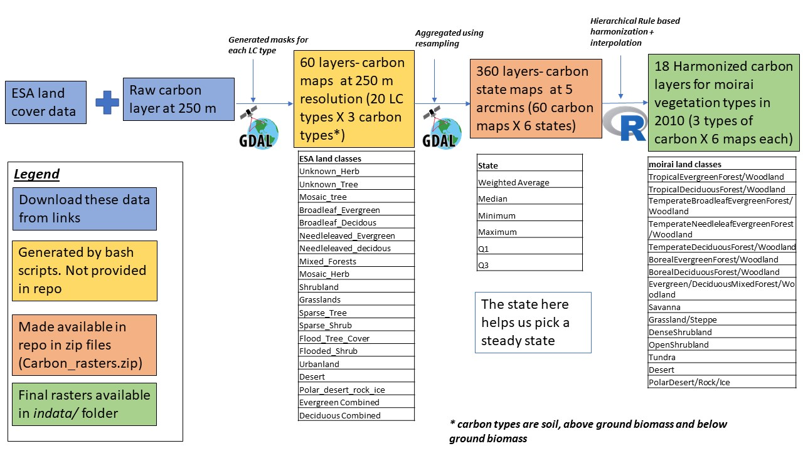

# Carbon data implementation and harmonization for  `moirai`  

## Description:
This folder contains a number of scripts which are used to generate 72 raster files (4 land types x 6 statistical states X 3 pools of carbon) that are used by `moirai`. The outputs are rasters where the carbon corresponding to individual land classes are harmonized to moirai's land use and land cover classes from the ESA/IGBP land classes. Note that the carbon data and/or ESA/IGBP classes are not available for cropland, urban land, and pasture. Carbon data for these managed classes are obtained from unmanaged land types that coincide with the Moirai cropland, urban land, and pasture distributions.

## Input carbon rasters (and the shell scripts used to generate them)
396 raster (.bil) files containing carbon by state and ESA/IGBP land class at a 5 arcmin resolution. These are generated using the bash scripts in the folder `bash_scripts`. To run the bash scripts, the user would need following,

### Raw land cover rasters
* The ESA land cover data (300 m resolution) that is available at https://www.esa-landcover-cci.org/?q=node/164
* The IGBP land cover data (1 km resolution) that is available at https://daac.ornl.gov/cgi-bin/dsviewer.pl?ds_id=968

* The IGBP land cover data (1 km resolution) that is available at https://climatedataguide.ucar.edu/climate-data/ceres-igbp-land-classification

* Soil carbon density data (~250 m resolution) that is available at https://data.isric.org/geonetwork/srv/eng/catalog.search#/metadata/ea80098c-bb18-44d8-84dc-a8a1fbadc061

* FAO Soil carbon density data (1km resolution) that is available at https://daac.ornl.gov/SOILS/guides/HWSD.html

* Above and below ground vegetation carbon data from Spawn et al (~300m). that is available at https://www.nature.com/articles/s41597-020-0444-4

Note that the user should run the above ground script (`Stage1_Pre_Process_Generate_LC.sh`) first since this script will generate land cover files that are used by the other four scripts.The total run time of the four scripts is 10 hours (2.5 hours per script).

### Intermediate rasters (Generated by shell scripts)
There are two sets of intermediate files generated by the shell scripts: 1) Very large rasters of carbon density by source land type at source resolution and 2) a set of these rasters aggregated to 5 arcmin by source land type and aggregation statistic (i.e., carbon state). The first set of rasters is intermediate to the shell scripts, while the second set is the output of the shell scripts. We do not provide the first set of rasters as they are very large, but we do provide the second set as described below.

720 raster (.bil) files containing carbon by state and ESA/IGBP land class at a 5 arcmin resolution. These are generated using the bash scripts in the folder `bash_scripts` and raw data described above. Note that the user should run the above ground script (`Generate_ESA_LC_rasters.sh`) first since this script will generate land cover files that are used by the other four scripts.The total run time of the four scripts is 10 hours (2.5 hours per script). 

For the sake of convenience the final 720 outputfiles from the above are made available as zip files (`Carbon_rasters.zip` for the moirai default and `FAO_carbon_rasters.zip` for the HWSD inputs. These are described in detail below in Figure 1.)

## Other inputs
These are the files in the folder `input_files`

* (1) `basin_to_country_mapping.csv`: Mapping file used to map GLU IDs to basin names.
* (2) `ESA_classes.csv`: 19 ESA land cover classes for the carbon accounting
* (3) `ESA_moirai_classes.csv`: Rules for the harmonization i.e. which land classes to map to the moirai cover with a prioritization scheme.
* (4) `IGBP_classes.csv`: 14 IGBP land cover classes for carbon accounting (Only used when using FAO HWSD data )
* (5) `IGBP_moirai_classes.csv`:  Rules for the harmonization i.e. which land classes to map to the moirai cover with a prioritization scheme.(Only used when using FAO HWSD data )
* (6) `gcam_glu_boundaries_moirai_land_cells_3p1_0p5arcmin.tif`: This is the GLU mapping raster that is generated by `diagnostics/generate_moirai_spatial.R`
* (7) `refveg_area_carbon.bil`: Carbon area for the reference carbon year set in `moirai.h`. Currently set to 2010. This file is copied from the base outputs of moirai
* (8) `refveg_carbon_thematic.bil`: Land cover classes from moirai in the reference carbon year (currently set to 2010). This file is also copied from the base outputs of moirai.
* (9)  `refveg_area_carbon_2000.bil`: Carbon area for the reference year (2000) set in `moirai.h`. Currently set to 2010. This file is copied from the base outputs of moirai. (Only used when using FAO HWSD data )
* (10) `refveg_carbon_thematic_2000.bil`: Land cover classes from moirai in the reference year  (2000). This file is also copied from the base outputs of moirai.(Only used when using FAO HWSD data )
* (11) `crop_area_carbon.bil`: Carbon area for crop carbon for a reference year
* (12) `pasture_area_carbon.bil`: Carbon area for pasture carbon for a reference year
* (13) `urban_area_carbon.bil`: Carbon area for carbon in urban lands for a reference year
* (14) Land use classes from moirai in the reference year  (2000 & 2010). These are .bil files corresponding to land use types (cropland, pasture & urbanland).

## Main harmonization scripts

The working directory for running these R scripts needs to be the folder that they reside in. These scripts create and outputs folder and an optional diagnostics folder.

`moirai_carbon_harmonization_Land_cover.R` which performs the harmonization for three  types of carbon (soil, above ground biomass, below ground biomass) for 6 states (weighted_average, min, max, q1, q3, median) for each unmanaged land type (18 files). Each type of carbon requires around 20 mins to run through (bringing the total runtime of the script to 1 hour).

`moirai_managedland_carbon_harmonization_LandUse.R` which performs the harmonization for three  types of carbon (soil, above ground biomass, below ground biomass) for 6 states (weighted_average, min, max, q1, q3, median) for each managed land type (crop, pasture, urban) (54 files). Each type of carbon requires around 20 mins to run through (bringing the total runtime of the script to 1 hour).

`moirai_carbon_harmonization_FAO.R` which performs the harmonization for soil carbon  for 6 states (weighted_average, min, max, q1, q3, median) (6 files). This script is also needed to produce the vegetation carbon files that correspond with the FAO land types associated with the soil data (12 files). Each type of carbon requires around 20 mins to run through (bringing the total runtime of the script to 1 hour). This script is specifically used only when using the FAO HWSD soil carbon data.

## Data availability by source and Moirai defaults

The table below explains the availability of data from different sources and the defaults used in `moirai`

## Outputs
72 carbon raster files (.envi) are requried by Moirai. For the convenience of the user, we have pre-generated the outputs for both the default and FAO options (144 files) and copied these files to moirai/indata. When choosing the FAO option make sure that all the carbon files are labelled with 'FAO.' The files have the following naming convention:

`<carbon pool>`_carbon`<optional FAO tag>`_`<optional managed type tag>`_`<state>`.envi

## Common questions related to inputs and outputs

### Do the carbon outputs represent managed land or unmanaged land or both ?

Currently the carbon outputs only represent carbon densities for unmanaged/undisturbed land. We are working on extending our approach to managed land types (Cropland, Pastures, Urbanland). Eventually, our outputs will include both carbon densities for managed and unmanaged land.

### What year do the carbon outputs from moirai represent ?

The carbon outputs by default (soil grids, spawn et al. data) represent the year 2010, but can also be re-programmed to generate outputs that represent the year 2000 (for the FAO outputs). See instructions below for the same. The user can also use any reference year by changing the reference carbon year in `moirai.h`. More detailed instructions are provided below.

### How can a user update the reference year i.e. can a user change the reference year to another year (e.g. 2015) so that the carbon outputs refer to the vegetation cover in this year?

To update the reference year, the following steps are involved:
* (1) First the user would have to set the reference carbon year in `moirai.h` to a new reference year (e.g. 2015)
* (2) Now the user must run `moirai` to re-generate `refveg_carbon_thematic.bil` and `refveg_area_carbon.bil`
* (3) Copy these files to the ancillary/carbon_harmonization/input_files folder
* (4) Re-run the moirai_carbon_harmonization.R script to regenerate new inputs (Run this for soil, aboveground biomass and below ground biomass)
* (5) Copy the outputs to the indata/ folder
* (6) Now when the user re-runs moirai, the carbon outputs will represent the new year

### How to use the FAO HWSD soil carbon for initialization?

The FAO HWSD has only data for soil carbon (These outputs are generated using `moirai_carbon_harmonization_FAO.R` ), but no data for vegetation carbon. Hence to use these outputs, the user will have to also create vegetation layers corresponding to the FAO reference year (2000) from Spawn et al. for above and below ground biomass using the script - `moirai_carbon_harmonization_FAO.R`. Note that the user will also have to set the reference carbon year to `2000` in `moirai.h`. This is necessary since both soil and vegetation carbon numbers need to use the same reference year.

### Do the carbon outputs represent managed land or unmanaged land or both ?

Carbon densities are produced for unmanaged land types and 3 types of management, namely cropland, pasture and urban land.

## Description of harmonization process

(NOTE THAT ALL STATISTICS AND PROCESSES DESCRIBED HERE FORWARD ONLY REFERENCE THE `moirai` DEFAULTS. BUT THE SAME PROCESS IS ALSO APPLICABLE TO THE FAO HWSD DATA)

The figure below describes the harmonization process from start to finish. We begin with the raw carbon data and the ESA land classes. Carbon is calculated for each ESA class. This carbon is then resampled to get the 5arcmin map for the same class for each of the 6 states. Finally the R script is used to harmonize the data to the `moirai` land cover in the reference year.

As a part of the final harmonization we also use a nearest neighbor interpolation to increase coverage. The current nearest neighbor interpolation is based on 10 nearest neighbors within the same land class. The table below shows the results of NODATA cells remaining by land class after interpolation (both for vegetation and soil). As indicated by the table, even after the interpolation no data is found for the Polar desert and rock ice and Tundra land types.   

*Land type**                               | **Total 5arcmin grid cells** | **Vegetation carbon Percentage unfound (NO DATA cells after interpolation)** | **Soil carbon Percentage unfound (NO DATA cells after interpolation)** |
| ------------------------------------------- | ---------------------------- | ---------------------------------------------------------------------------- | ---------------------------------------------------------------------- |
| Pasture                                     | 1195396                      | 2.3                                                                          | 2.3                                                                    |
| Cropland                                    | 952850                       | 17.0                                                                         | 17.0                                                                   |
| Grassland/Steppe                            | 498404                       | 15.0                                                                         | 14.6                                                                   |
| OpenShrubland                               | 274296                       | 16.0                                                                         | 16.0                                                                   |
| Desert                                      | 195579                       | 1.0                                                                          | 1.1                                                                    |
| TropicalEvergreenForest/Woodland            | 190780                       | 0.0                                                                          | 0.3                                                                    |
| Savanna                                     | 173776                       | 8.0                                                                          | 7.6                                                                    |
| BorealEvergreenForest/Woodland              | 148756                       | 0.0                                                                          | 0.0                                                                    |
| Polardesert/rock/ice                        | 132021                       | 29.0                                                                         | 24.9                                                                   |
| Urban                                       | 119597                       | 22.3                                                                         | 22.3                                                                   |
| TemperateDeciduousForest/Woodland           | 86922                        | 1.0                                                                          | 1.1                                                                    |
| DenseShrubland                              | 78065                        | 10.0                                                                         | 9.5                                                                    |
| TemperateNeedleleafEvergreenForest/Woodland | 71600                        | 1.0                                                                          | 0.5                                                                    |
| BorealDeciduousForest/Woodland              | 65824                        | 0.0                                                                          | 0.4                                                                    |
| TropicalDeciduousForest/Woodland            | 56377                        | 1.0                                                                          | 1.4                                                                    |
| Tundra                                      | 25000                        | 29.0                                                                         | 24.9                                                                   |
| TemperateBroadleafEvergreenForest/Woodland  | 14395                        | 0.0                                                                          | 0.3                                                                    |

## Summary of Outputs

With the above, We now have results for soil and vegetation carbon that are harmonized with respect to the moirai land classes. The map below shows the global soil carbon in MgC/ha by 5 arcmin grid cells differentiated by moirai LC type.

## Citations for raw data
We also include citations for the data from the FAO Harmonized World Soil Database.

| file names                    | data description                                                                                 | source                                                                                                     | citation                                                                                                                                                                                                                                |
|-------------------------------|--------------------------------------------------------------------------------------------------|------------------------------------------------------------------------------------------------------------|-----------------------------------------------------------------------------------------------------------------------------------------------------------------------------------------------------------------------------------------|
| soil_carbon_`<state>`.envi | soil grids (2.0) carbon density in MgC/ha for 0-30 cm, based on 95th perecntile of soil characteristics, for the year 2010. **Note that the Q3 state of this dataset is the current default for soil carbon calculations in moirai**                          | https://www.isric.org/explore/soilgrids                                                                    | Hengl, T., Mendes de Jesus, J., Heuvelink, G. B., Ruiperez Gonzalez, M., Kilibarda, M., Blagotić, A., … & Guevara, M. A. (2017). SoilGrids250m: Global gridded soil information based on machine learning. PLoS one, 12(2), e0169748. |
| soil_carbonFAO_`<state>`.bil           | FAO harmonized world soil database (v1.2), soil carbon density in MgC/ha for a depth of 0-30 cm, for the year 2010 | http://www.fao.org/soils-portal/soil-survey/soil-maps-and-databases/harmonized-world-soil-database-v12/en/ | Fischer, G., F. Nachtergaele, S. Prieler, H.T. van Velthuizen, L. Verelst, D. Wiberg, 2008. Global Agro-ecological Zones Assessment for Agriculture (GAEZ 2008). IIASA, Laxenburg, Austria and FAO, Rome, Italy.                        |

* **Vegetation carbon density rasters (12)** (`AG_carbon_<state>.bil`,`AG_carbonFAO_<state>.bil` ,`BG_carbon_<state>.bil` and `BG_carbonFAO_<state>.bil`):
	* These data should be cited as-
	Spawn, S.A., Sullivan, C.C., Lark, T.J. et al. Harmonized global maps of above and belowground biomass carbon density in the year 2010. Sci Data 7, 112 (2020). https://doi.org/10.1038/s41597-020-0444-4 (Note that the files with the FAO in their names represent carbon densities for the year 2000)
