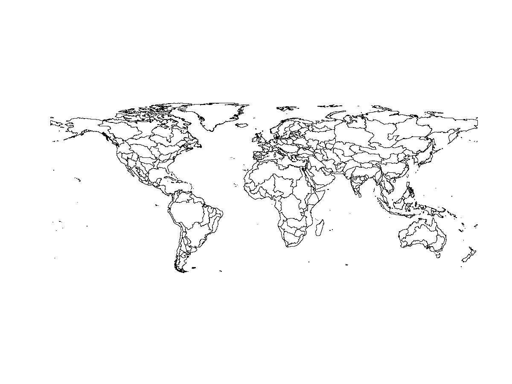
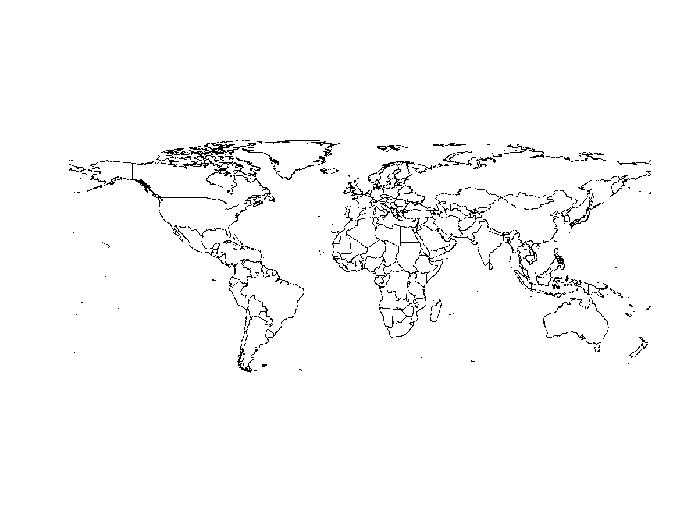
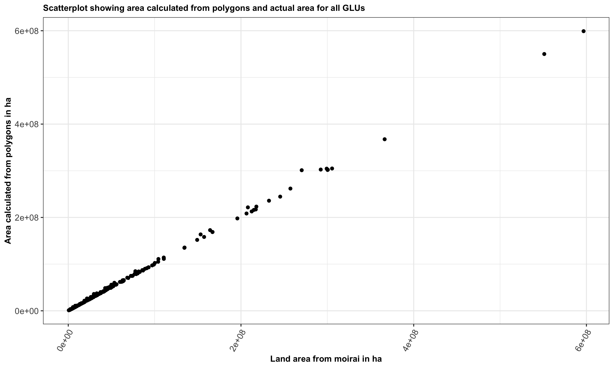
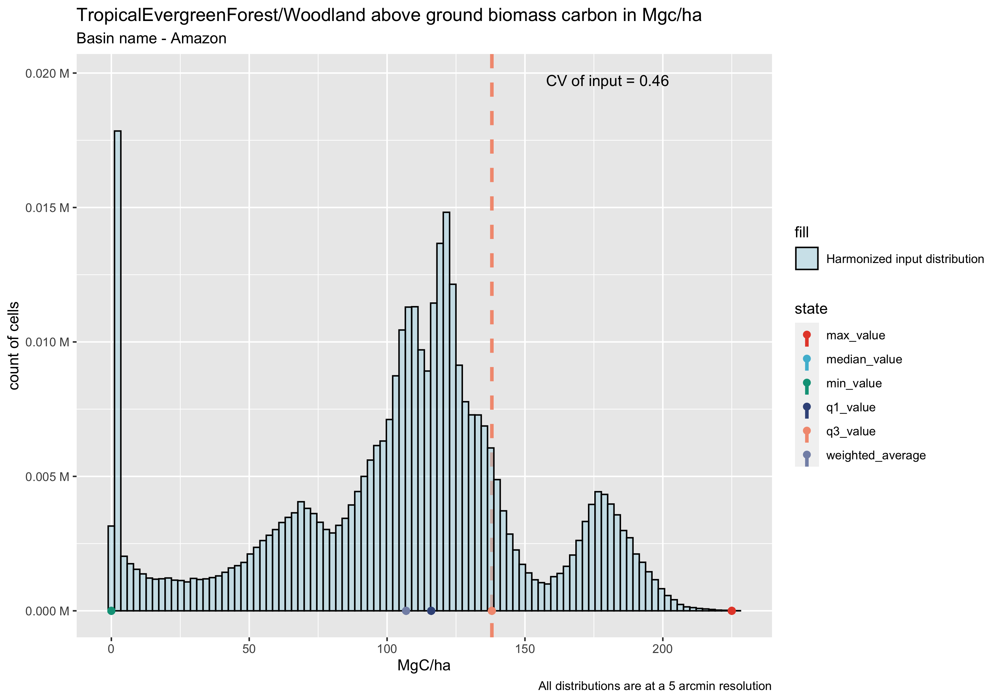
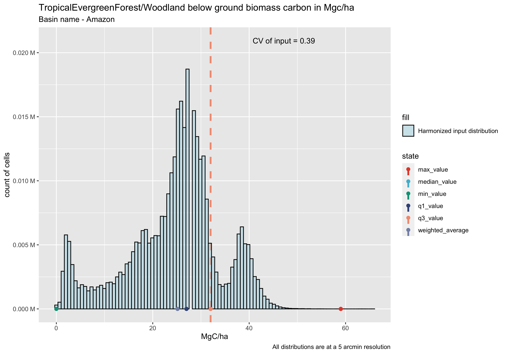
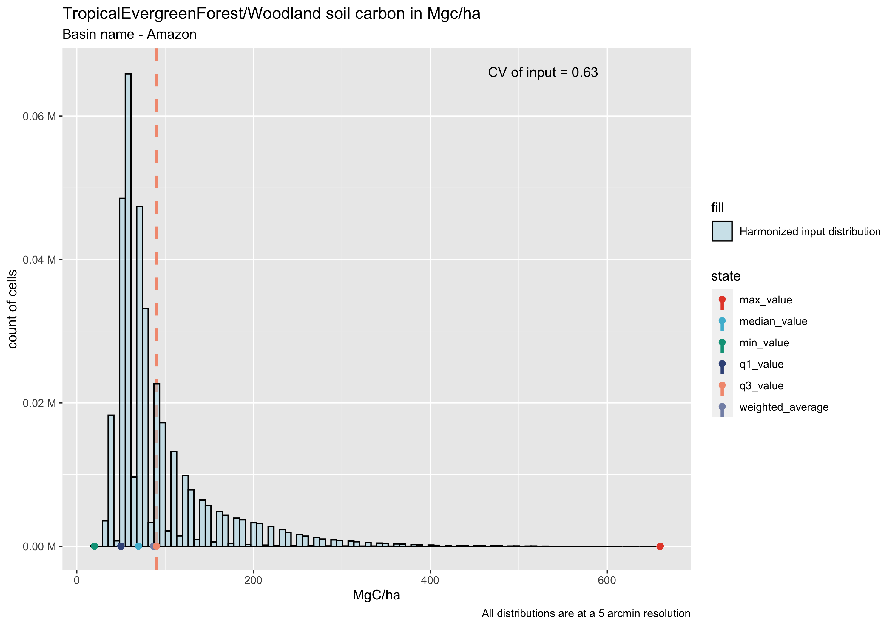
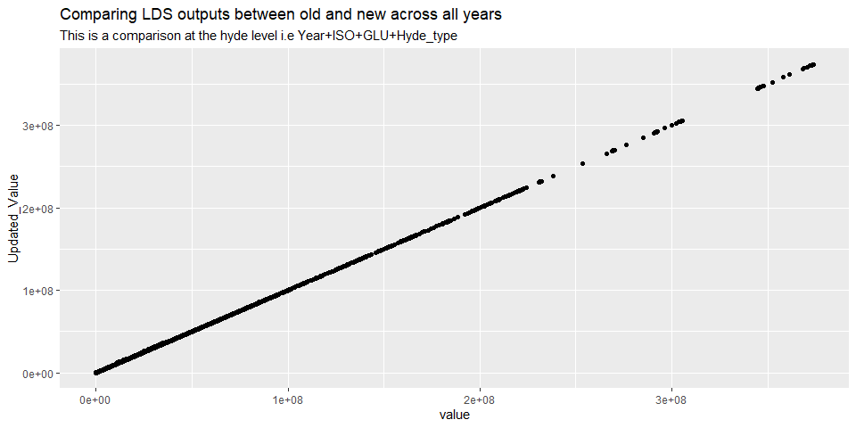

# Description:
This folder contains a number of diagnostics scripts and functions that can be used to verify, analyze and explore the outputs of the `moirai` LDS. It is recommended to set the R working directory to this diagnostics folder as the default paths assume that this is the case. It is also recommended to change the diagnostic output directory names in the scripts/functions to uniquely identify the Moirai outputs being diagnosed. There are 4 types of diagnostics and exploration outputs that can be currently generated from moirai:

* (1) Spatial products (shape files and rasters) based on moirai land data outputs.
* (2) Analysis of carbon outputs (soil and vegetation).
* (3) Comparison of land area outputs from different versions.
* (4) Comprehensive crop, land rent, and land area output diagnostics.

Note: `moirai_diagnostics_vignette.rmd` provides examples of all of the functions for (2),(3).

# Generating spatial products using land outputs from moirai (`generate_moirai_stpatial.R`)

The script `generate_moirai_spatial.R` located in the diagnostics folder can be used to generate various spatial products using the outputs of the moirai LDS. This script was used to generate the valid spatial files provided in `…/moirai/ancillary/moirai_valid_boundaries.zip`. This script takes about 15 minutes to run.

## Summary of outputs

The script generates a set of 18 vector shape files for visualization. Vector files are generated at 3 main spatial levels, namely country, region, and geographic land unit (GLU). Additionally, files are generated for 3 different intersections of the 3 main spatial levels: intersection of country and GLU boundaries (ctry_glu), intersection of region and basin boundaries (reg_glu), and intersection of region and country boundaries (reg_ctry). Since the land data system does not generate land information for all cells within the above mentioned boundaries (e.g., inland water bodies may be excluded), vector files are also generated for 3 cell classes for each of the 6 boundary categories: land cells, cells with no land, and combined land and no land. The vector files for land cells are most representative of the valid Moirai output area. The vector files for the combined cells may include additional water cells that were filled in because they were completely surrounded by water and land cells.

Column names in vector file outputs:

* (1) `key`: Unique identifier for feature
* (2) `reg_id`: Unique identifier for region (region number)
* (3) `ctry_id`:Uniqueidentifier for country (country number)
* (4) `glu_id`: Uniqueidentifier for glu (basin number)
* (5) `reg_nm`: Region name
* (6) `ctry_nm`: Country name
* (7) `glu_nm`: glu/basin name

Th plots below show outputs for basin boundaries(Figure 1) and country boundaries (Figure 2) for the combined (land + noland) category.

Figure 1: Basin boundaries from moirai shape files for land and non-land cells

Figure 2: Country boundaries from moirai shape files for land and non-land cell

In addition to the main outputs, the code also generates the following outputs in case required by the user:
* (1) raster files (.tif files) for each of the 18 files described above
 * Note that the raster files for the land cells are contain the valid cells that are used to generate the Moirai outputs. These valid cells are determined by the intersection of the following valid input data: HYDE land area > 0, GLU definition, country definition, and country 87 definition
* (2) mapping files (CSV files) for each of the 6 spatial boundaries
* (3) raw shape files i.e. shapefiles without any metadata (in case user would like to add their own metadata)
* (4) diagnostics related to area calculated from the shape files.

## Inputs required

All inputs are stored in the folder `…/moirai/diagnostics/spatial_input_files/`, and the current set of files is based on `…/moirai/example_outputs/basins235/`. The land area .csv file is a main Moirai output. The seven .bil files are Moirai diagnostic outputs, and the three mapping .csv files are Moirai inputs from `…/moirai/indata/`. The inputs required and their usage is described as follows.

Note - To update spatial inputs, please generate the moirai diagnostic outputs and copy files (1) to (5) from the `…/moirai/outputs/<desired_output_directory>` directory to the `…/moirai/diagnostics/spatial_input_files/` directory. Note that the corresponding .hdr files are required but do not need to be copied because the file formats do not change. Files (5)-(7) are in the `…/moirai/indata/` directory. Please copy these input files to the `…/moirai/diagnostics/spatial_input_files/` directory as well, in case they have been modified (note the name change for the region names file). If using 18 AEZ outputs for Moirai then file (8) will be AEZ_orig_lds.csv and this will have to be changed in the script.

* (1) `Land_type_area_ha.csv` is a moirai output file that is used for the validation plot.
* (2) `valid_land_area.bil` which is raster containing information on valid land area output by moirai. This is required for the purpose of validation.
* (3) `country_out.bil` and `country_out_noland.bil` which represent the the valid country boundaries with and without land cells respectively.
* (4) `glu_raster.bil` and `glu_raster_noland.bil` which represent the the valid GLU boundaries with and without land cells respectively.
* (5) `region_gcam_out.bil` and `region_gcam_out_noland.bil` which represent the the valid region boundaries with and without land cells respectively.
* (6) `GCAM_region_names.csv` which is used to fill in region names (metadata). This is a generic-named copy of the GCAM_region_names_#reg.csv in indata, with the same format.
* (7) `FAO_iso_VMAP0_ctry.csv` which is used to fill in country names (metadata). This is a copy of the file in indata.
* (8) `Global235_CLM_5arcmin.csv` which is used to fill in GLU names (metadata). For 18 AEZs this file is `AEZ_orig_lds.csv`. This is a copy of the file in indata. If you have created a new GLU file with new column names you will have to add a new clause to the if statement in this script that identifies which GLU set is being used.

## Additional software required

The polygonization code within the script requires either OSGEO to be installed (which is recommended to be installed for Windows users) or gdal bindings in python (which is recommended for MAC users). The user has to provide either the path to a OSGEO .bat file in case of the former or to the location of the gdal_polygonize.py file in case of the latter.

## User defined/customizable parameters

In addition to the inputs described above, the user can specify/change values for a number of parameters in the script, as follows:

(1) `out_dir`: This is the top level diagnostic output directory that will contain all of the spatial diagnostic files, grouped into 5 subdirectories. The default value is "spatial_output_files".

(2) `no_data_value_moirai`: This is the NODATA value for moirai. It is currently set to -9999.

(3) `hole_filling_threshold`: This is the threshold in m2 above which all holes in polygons will be filled for the 'combined' shapefiles. New holes are introduced when merging the land and the no_land cells to generate the boundaries. The hole filling is applied (only to the combined shapefiles) to ensure that they can be used within other systems. The default value is 1e=19.

Note: The hole filling threshold may sometimes fill in data for water bodies (where boundaries are not available for the water bodies because of inlets). An example of where this occurs is Lake Maracaibo in Venezuela. Because of this, we recommend that the combined shapefiles be considered only as political boundaries and not a representation of actual land.

(4) `raster_combinations`: This is a vector of the different boundaries for which shapefiles can be generated. Currently, shapefiles are generated for all 6 spatial boundaries described above. But the user can also run the script for a selected set of boundaries by manipulating this parameter.

(5)`use_osgeo`: This is a boolean that when set to TRUE will use osgeo. Otherwise, gdal_polygonize.py will be used for the polygonization (converting rasters to polygons). The default value is TRUE.

(6)`osgeopath`: The path for osgeo when use_osgeo==TRUE. The default value is "c:/OSGeo4W64/OSGeo4W.bat".

(7)`pypath`: The path and call to python on the user computer. This is required only in cases where osgeo is not used/available (mostly for MAC users). The default value is "python".

(8)`gdalpolygonize_path`: This is the path and call to the gdal_polygonize.py file. Once again, this needs to be defined only in cases where osgeo is not used. The default value is "/Library/Frameworks/GDAL.Framework/Programs/gdal_polygonize.py ".

## Validation

There are a number of validation checks that are implemented within the script, including:

(1) Checks to ensure the different rasters are aligned and standardized

(2) Checks to ensure the rasters are aligned with the CSV land outputs of moirai

(3) Checks to ensure metadata is added for all features correctly and no features are dropped.

Figure 3 below is a validation plot (generated by the script) that compares the geometrical area of polygons for the basin level shapefile with the actual (terrain area) from the CSV outputs at the basin level. The small differences are related to coastal pixels where both land and water are present in the pixel. For these locations the geometric polygon area calculated from the shapefiles includes both land and water while the actual terrain area output by Moirai includes only the land area.

Figure 3: Geomteric area vs terrain area at the basin level

# Functions to analyze/explore carbon outputs (`Carbon_diagnostic_functions.R`)

## Introduction

Moirai outputs 6 carbon states for each of soil carbon (depth of 0-30 cm), above ground vegetation carbon, and below ground vegetation carbon. These states are determined by country iso, water basin, and land type (managed and unmanaged). These carbon diagnostics do not split basins by country (i.e., country delineations are ignored).

Carbon density output values are diagnosed for 6 states: weighted_average, median, minimum, maximum, quartile 1 and quartile 3. The user can select one of two sources for the soil carbon data (soilgrids or the Harmonized World Soil Database from the FAO); this selection is determined by the specified Moirai input arguments and the diagnostic function arguments. Note that the vegetation carbon is also dependent on the soil carbon source as the land type mapping is different for soilgrids than for FAO/HWSD.

The Moirai carbon outputs are stored in the file `Ref_veg_carbon_Mg_per_ha.csv` in the outputs folder. This file contains distinct carbon data for both the managed and unmanaged land types. The land types are listed in path_to_lt_mapping file associated with the Moirai outputs (e.g., `../example_outputs/basins235/MOIRAI_land_types.csv`). The managed carbon data are reported for the HYDE Cropland, Pasture, and UrbanLand LT_HYDE types, and are determined based on the HYDE/Moirai land type distribution, and so there are not corresponding ESA carbon distributions to compare with. This is because ESA cropland and urban land do not contain values in the carbon datasets, and pasture is not an ESA category. The unmanaged carbon data are reported for the LT_SAGE land types and are determined based on the ESA-Moirai land cover mapping, so there is an option to plot corresponding ESA carbon distributions as well. Note that Moirai input distributions are based on the harmonized input carbon data, and the ESA-based distributions are based on the pre-harmonized, primary ESA land type corresponding with the specified Moirai land type (see `../ancillary/carbon_harmonization/input_files/ESA_moirai_classes.csv`). Both of these distributions comprise the six state values for each relevant 5 arcmin pixel. The user can make diagnostic plots of Moirai input carbon distributions and output values by GLU/basin and land type with the following functions in `Carbon_diagnostic_functions.R`:

Unmanaged land types with optional comparison to ESA land type distribution:

(1) `compare_carbon_distribution_ESA()`

Managed land types (Cropland, Pasture, UrbanLand):

(2) `compare_carbon_distribution_HYDE()`

## Description of outputs

These functions generate histogram plots showing the distribution of harmonized Moirai input carbon state data (and optionally the distribution of pre-harmonized, primary ESA land type carbon state data for unmanaged types) along with points that show the Moirai output carbon values for each state for the selected GLU/basin and land type. This diagnostic allows the user to verify that the values for each state are reasonable for the basin, based on the input data distribution. This may also be useful to users interested in comparing carbon numbers with numbers from other datasets or the literature. These functions take a few minutes each to run.

Figures 5 ,6 and 7 below present example plots for soil and vegetation carbon for tropical evergreen forest/woodland in the Amazon basin from recent Moirai outputs.

Figure 5: Distribution of above ground vegetation carbon for tropical evergreen forest/woodland in the Amazon basin

Figure 6: Distribution of below ground vegetation carbon for tropical evergreen forest/woodland in the Amazon basin

Figure 7: Distribution of soil carbon for tropical evergreen forest/woodland in the Amazon basin

Note : Where basin boundaries are distributed across two or more countries, the functions aggregate the values from the countries to represent the entire basin for each state of carbon.

## Saving diagnostic carbon plots and data
The functions are designed for exploratory analysis and generate one plot for a specific GLU/basins and land type at one time. As such, the functions show an on-screen plot and return a ggplot object, but do not automatically save the plot or the data. The user is responsible for saving the plot using ggsave() or a device function (e.g, pdf()). If the user wants to save the data behind the plot they will have to first set all of the arguments and run the code within the function interactively, and then use write.csv() to write out the desired data objects (harmonized_data_filtered, Carbon_data_csv, and optionally t).

## Example use case

The user can change/specify the arguments to these functions, although some of the default values will be sufficient for most applications. The carbon_type, moirai_LC, and harmonized_carbon_raster_file_names arguments must match each other. The working directory is assumed to be `…/moirai/diagnostics/`. Here is the list of input arguments and their default values:

Both functions, arguments that user should specify
* carbon_type = `above ground biomass`; can also be `below ground biomass` or `soil`.
* moirai_LC = `TropicalEvergreenForest/Woodland` or `Cropland`; available values are listed in the `../example_outputs/basins235/MOIRAI_land_types.csv` file. LT_SAGE values are for `compare_carbon_distribution_ESA()` and LT_HYDE values are for `compare_carbon_distribution_HYDE()`. "Unknown" and "Unmanaged" values will not produce results.
* basin_for_testing = `Amazon`; available values are listed in the `Basin_name` column of `../ancillary/carbon_harmonization/input_files/basin_to_country_mapping.csv`.
* year_of_reference = `2010`; available years are listed in the `year` column of `../example_outputs/basins235/Land_type_area_ha.csv`. Use the default value of `2010` for comparing unmanaged land outputs against ESA data because this is the nominal year that the ESA land type area represents.
* harmonized_carbon_raster_file_names = `c("AG_carbon_q1.envi", "AG_carbon_q3.envi", "AG_carbon_median.envi", "AG_carbon_min.envi", "AG_carbon_max.envi", "AG_carbon_weighted_average.envi")` for `compare_carbon_distribution_ESA()` and `c("AG_carbon_crop_q1.envi", "AG_carbon_crop_q3.envi", "AG_carbon_crop_median.envi", "AG_carbon_crop_min.envi", "AG_carbon_crop_max.envi", "AG_carbon_crop_weighted_average.envi")` for `compare_carbon_distribution_HYDE()`; these values are the corresponding carbon input files in `../indata/`.
* path_to_carbon_outputs = `../example_outputs/basins235/Ref_veg_carbon_Mg_per_ha.csv`; this should be the corresponding output file from your Moirai run.
* path_to_land_outputs = `../example_outputs/basins235/Land_type_area_ha.csv`; this should be the corresponding output file from your Moirai run.
* path_to_lt_mapping = `../example_outputs/basins235/MOIRAI_land_types.csv`; this should be the corresponding output file from your Moirai run.

Both functions, arguments that do not need to be specified
* path_to_basin_mapping = `../ancillary/carbon_harmonization/input_files/basin_to_country_mapping.csv`; water basin identities.
* path_to_glu_data = `../ancillary/carbon_harmonization/input_files/gcam_glu_boundaries_moirai_land_cells_3p1_0p5arcmin.tif`; thematic file of the water basin pixel locations.
* path_to_moirai_ref_veg_thematic = `../ancillary/carbon_harmonization/input_files/refveg_carbon_thematic.bil`; thematic file of the Moirai land types for carbon locations.
* path_to_sage_mapping = `../indata/SAGE_PVLT.csv`; list of unmanaged land type codes.
* path_to_harmonized_rasters = `../indata/`; location of input carbon data.

The `compare_carbon_distribution_ESA()` function only , argument that user should specify
* produce_ESA_distribution = `FALSE`; set this to "TRUE" to show the ESA land type carbon distribuiton

The `compare_carbon_distribution_ESA()` function only , arguments that do not need to be specified
* path_to_ESA_rasters = `../ancillary/carbon_harmonization/Carbon_rasters`
* path_to_moirai_ESA = `../ancillary/carbon_harmonization/input_files/ESA_moirai_classes.csv`

# Functions to validate/test land area outputs (`Compare_LDS_area_outputs.R`)

## Introduction

One of the main outputs of the moirai LDS is the land area by type (`Land_type_area_ha.csv`). Changes in inputs or code may influence the land area output. Moreover these changes may differ by level of disaggregation. For example, differences in new outputs may be reasonable at the highest level (country ISO level) but there may be significant differences at the lower levels of disaggregation (SAGE type/HYDE type). Through the use of these functions the user can identify such differences along with their source, and test whether these differences are reasonable. These functions are exploratory and do not write any files, and they take about one minute each to run. The land area diagnostic script (`plot_moirai_land_type_area.r`, see below) plots time series of land area and writes them to files.

## Description of functions

The following functions generate land area comparison plots and test for differences:

(1) `compare_iso_land_data`: This function compares new land outputs and older outputs (outputs from a previous model version of moirai) at the country ISO level for each year.

(2) `compare_iso_glu_land_data`: This function compares outputs at the country_basin boundary level for each year.

(3) `compare_iso_glu_hyde_land_data`: This function compares outputs at the country_basin_hyde-land-use level for each year.

(4) `compare_iso_glu_hyde_sage_land_data`: This function compares outputs at the country_basin_hyde-land-use_sage-vegetation level for each year.

Note : If the differences found by the functions are above a user selected level of tolerance, an error message is automatically generated. This tolerance is applied to an average difference metric across the pixels. This does not necessarily mean that the changes are incorrect. It does mean that they are significantly different.

## User specified arguments

The user can specify the arguments to the functions. All functions have the following arguments (default values are identical for old and new because this is the new baseline):
* path_to_Original_LDS_Data = `../example_outputs/basins235/Land_type_area_ha.csv`; previous land area output file including path
* path_to_Updated_LDS_Data = `../example_outputs/basins235/Land_type_area_ha.csv`; new land area output file including path
* path_to_old_mapping = `../example_outputs/basins235/MOIRAI_land_types.csv`; previsous land type mapping file including path
* path_to_new_mapping = `../example_outputs/basins235/MOIRAI_land_types.csv`; new land type mapping file including path
* error_tolerance = `0.01`; this parameter specifies an acceptable level of percent error between the new and the old outputs. Minute differences are expected on account of rounding, but aggregate results are not expected to change (unless base data has changed).
* create_land_plot = `TRUE`; This is a boolean flag, which when set to TRUE will create a scatterplot comparing old and new results for the specific level of comparison. Figure 6 below shows the comparison of land outputs in hectares at the ISO-GLU-HYDE-YEAR level.

The three functions that disaggregate to hyde and sage levels have these additional arguments:
* print_difference_stats = `TRUE`; Setting this boolean to true will print out a summary of differences for the user which help identify the source of the difference (The specific ISO, GLU where the difference is coming from)
* absolute_diff_tolerance = `3`; specifies the acceptable difference in absolute values between the old and new outputs
* percent_diff_tolerance = `0.5`; specifies the acceptable difference in percent difference between the old and new outputs.

Figure 6: Comparison of land outputs at the ISO-GLU-HYDE-YEAR level

# Comprehensive crop, land type, and land rent diagnostics
There are four R scripts in `…/moirai/diagnostics` that generate several diagnostic figures and also make some statistical comparisons. Make sure that `…/moirai/diagnostics` is the R working directory before running the scripts. Each script writes to a user-specified directory within the outputs directory. Set this diagnostic output directory within each script. Each script has a detailed description at the beginning, and comments identifying the relevant directories, files, and flags that the user can change to customize the outputs. Note that these are designed to work specifically with the supported GLUs (18 AEZs or 235 water basins).

## Crop diagnostics
To diagnose country-level harvested area and production outputs, use `plot_moirai_crop_ctry.r`.

To diagnose GCAM-region_GLU harvested area and production outputs, use `plot_moirai_crop_rglu.r`. Note that the difference statistics and the KS tests in `plot_moirai_crop_rglu.r` are invalid when the geographic land units are not identical among the different data sets.

## Land area diagnostics
To diagnose the land type area output, use `plot_moirai_land_type_area.r`. This script plots land area over time for cropland, pasture, urban, and remaining land, by country_GLU and globally, for two specified Moirai outputs and a legacy output of the original GCAM GIS system. It also makes comparison plots between these data at the country level and globally.

## Land rent diagnostics
To diagnose the land rent outputs by the 87-country boundaries use `plot_moirai_landrent_glu.r`. These diagnostics can be performed at three different regional aggregations: 87-country, 14 GCAM regions, and 32 GCAM regions. This function will diagnose a single Moirai output with an old land data output and the original GTAP data. It is not configured to compare two Moirai outputs. Note that the difference statistics, scatterplot, and KS tests in `plot_moirai_landrent_glu.r` are invalid when the geographic land units are not identical among the different data sets (e.g., when comparing 18 AEZs vs 235 GLUs). The mapping of countries to the 87-country boundaries is in `…/moirai/indata/GAO_ctry_GCAM_ctry87.csv`, and the 87-country names are in `…/moirai/indata/GTAP_GCAM_ctry87.csv`.
